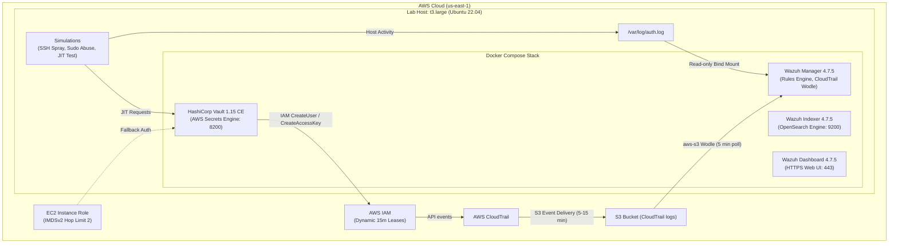

# Identity Threat Detection & Response Lab (Vault + Wazuh on AWS)

An end-to-end identity security and threat detection engineering lab running HashiCorp Vault Community Edition and a single-node Wazuh SIEM stack on AWS. The lab demonstrates dynamic Just-In-Time (JIT) AWS IAM credential brokering, host and cloud threat telemetry ingestion, and automated SOC incident response mapped to the MITRE ATT&CK framework.

## Architecture



## What Was Built and Verified

| Component | Technology | Role in Lab | Verification Status |
| :--- | :--- | :--- | :--- |
| **Infrastructure as Code** | Terraform | Single t3.large host, VPC, S3, CloudTrail, IAM instance profile, locked Security Group | Verified: terraform apply created 16 resources; terraform destroy removed 16 and post-destroy checks found nothing left |
| **Identity Brokering** | HashiCorp Vault 1.15 Community | Dynamic IAM user generation via AWS secrets engine (`credential_type=iam_user`) | Verified: dev-jit-role issued 900s leases; explicit revoke deleted the IAM user; an unrevoked lease's IAM user was auto-deleted by Vault after 15 minutes; a dev-policy token was denied on secops-jit-role (secops-jit-role was only tested for that denial; no credentials were issued from it) |
| **SIEM & Detection Engine** | Wazuh 4.7.5 Single-Node | Ingests `/var/log/auth.log` via bind mount and CloudTrail via `aws-s3` wodle | Verified: 33 custom alerts generated across 5 rules |
| **Host Log Ingestion** | Linux Syslog (`auth.log`) | Real-time SSH and sudo telemetry parsed directly by Wazuh Manager (`agent 000`) | Verified: 10 single SSH-failure alerts and 3 composite brute-force alerts (100100/100101); 3 single sudo-violation alerts and 1 composite escalation alert (100200/100201) |
| **Cloud Telemetry** | AWS CloudTrail + S3 | Cloud IAM management plane auditing ingested periodically by Wazuh wodle | Verified: 16 CloudTrail `CreateUser`/`CreateAccessKey` alerts (Rule 100300) |
| **Incident Response** | Markdown Runbook | Actionable SOC containment procedures for brute force, sudo abuse, and IAM alerts | Written to fit one page (about 400 words); commands were not executed against the live alerts |

## How to Run

### 1. Prerequisites and Configuration
Ensure AWS CLI v2 and Terraform >= 1.5 are installed locally. Find your current public IP address:
```bash
curl -s https://checkip.amazonaws.com
```

Generate an SSH key pair for the lab:
```bash
ssh-keygen -t ed25519 -f ~/.ssh/itdl-lab -N ""
```

Create `terraform/terraform.tfvars`:
```hcl
allowed_cidr_blocks = ["<YOUR_PUBLIC_IP>/32"]
```
Note: The AWS region (`us-east-1`), SSH public key path (`~/.ssh/itdl-lab.pub`), and max runtime (`max_runtime_minutes = 300`) have preconfigured defaults in `variables.tf`.

### 2. Provision Infrastructure
```bash
cd terraform
terraform init
terraform plan -out=tfplan
terraform apply tfplan
```
Note the output `ec2_public_ip`, `vault_ui_url`, and `wazuh_dashboard_url`.

### 3. Wait for Cloud-Init and Connect
Cloud-init provisions Docker, pulls images, mounts swap, and sets security controls (~8-10 minutes):
```bash
ssh -i ~/.ssh/itdl-lab ubuntu@<EC2_PUBLIC_IP>
cloud-init status --wait
```
Wait until cloud-init finishes. Run the verification script:
```bash
sudo bash /opt/identity-lab/scripts/verify_stack.sh
```

> [!NOTE]
> **First-boot quirk**: The first `docker compose up` can fail with `"failed to bind host port 0.0.0.0:55000: address already in use"` (transient; the exact cause was not confirmed, most likely the ephemeral port range). Symptom: `wazuh-manager` is stuck in Created state or shows an empty PORTS column, the dashboard says "No API available to connect", and bootstrap stops early. Fix: `sudo sysctl -w net.ipv4.ip_local_reserved_ports=55000`, then from `/opt/identity-lab/docker` run `sudo docker compose up -d --force-recreate wazuh.manager`.

### 4. Initialize Vault and AWS Secrets Engine
Initialize Vault and configure the dynamic IAM secrets engine from the host:
```bash
sudo bash /opt/identity-lab/docker/vault/scripts/init_vault_aws.sh
```
This enables the AWS secrets engine, sets lease TTLs (`lease=15m lease_max=1h`), and creates `dev-jit-role` and `secops-jit-role`.

### 5. Execute Attack Simulations
Run the automated threat simulations on the host:
```bash
cd /opt/identity-lab/simulations

# Simulation 1: SSH Username Spray (15 invalid user attempts)
./simulate_ssh_bruteforce.sh 127.0.0.1 22 15

# Simulation 2: Linux Privilege Escalation (4 unauthorized sudo commands)
./simulate_priv_esc.sh

# Simulation 3: Dynamic JIT Credential Request and Validation
sudo ./simulate_vault_jit_access.sh

# Dynamic JIT Expiry Verification
sudo ./simulate_vault_jit_access.sh --leave-unrevoked
# Wait 15+ minutes for lease expiration
sudo ./verify_expiry.sh
```

Check alert output in Wazuh:
```bash
sudo docker exec wazuh-manager grep -E '"id":"(100100|100101|100200|100201|100300)"' /var/ossec/logs/alerts/alerts.json
```

### 6. Teardown
To avoid unnecessary AWS charges, destroy all infrastructure immediately after testing:
```bash
cd terraform
terraform destroy -auto-approve
```

## Cost Breakdown

Estimated from runtime x hourly rate; not yet confirmed in AWS Cost Explorer. Compute: one t3.large at $0.0832/hour for about 2h25m, roughly $0.20. Storage (40 GB gp3), CloudTrail and S3 added a few cents at most. t3.large is not free-tier eligible, and the Wazuh stack needs several GB of RAM (the indexer alone used about 1.3 GiB in this run). A dead-man switch (max_runtime_minutes, default 300, terminate-on-shutdown) terminates the instance if it is forgotten. Destroy as soon as testing ends.

## MITRE ATT&CK Mapping Summary

| Rule ID | Level | Tactic | Technique | Name | Live Alerts |
| :--- | :--- | :--- | :--- | :--- | :--- |
| **100100** | 5 | Credential Access | T1110.001 | Password Guessing | 10 |
| **100101** | 10 | Credential Access | T1110.001 / T1110.003 | Password Guessing & Spraying | 3 |
| **100200** | 7 | Privilege Escalation | T1548.003 / T1078 | Sudo and Sudo Caching | 3 |
| **100201** | 12 | Privilege Escalation | T1548.003 | Sudo Abuse Escalation | 1 |
| **100300** | 8 | Persistence | T1078.004 / T1098 | Account Manipulation / IAM Creation | 16 |

See [`docs/MITRE_ATTCK_MAPPINGS.md`](docs/MITRE_ATTCK_MAPPINGS.md) for full technique breakdowns, parent rule inheritance, and observed built-in rules.

## Limitations and Honest Engineering Notes

1. **Single-Node Deployment**: Wazuh Indexer, Manager, and Dashboard run on a single host. In enterprise production, Indexer and Manager should be clustered across multi-AZ instances.
2. **Localhost Ingestion**: The Wazuh Manager reads `/var/log/auth.log` directly via a read-only bind mount rather than deploying a standalone Wazuh Agent. Telemetry displays agent ID `000` (`wazuh.manager`).
3. **Simulation Source**: SSH brute-force and sudo abuse attacks originated from `127.0.0.1` and a local test user (`lab_contractor`) to maintain an isolated, self-contained test environment.
4. **CloudTrail Latency**: AWS CloudTrail log delivery to S3 typically takes 5-15 minutes, and the Wazuh `aws-s3` wodle polls on a 5-minute interval. CloudTrail alerts are not instantaneous.
5. **Vault IAM Generation Detection**: Wazuh Rule `100300` fires on any `CreateUser` or `CreateAccessKey` event, which includes legitimate credentials created by HashiCorp Vault. In production, Vault's IAM principal must be allowlisted to reduce alert fatigue.
6. **Lab-only credentials and secrets handling**: Wazuh uses upstream default credentials; Vault is initialised with a single key share and its unseal key and root token are stored in /opt/identity-lab/vault-init.json on the host; the Vault listener is plain HTTP. Access was limited by a /32 security group.
7. **AI-Assisted Authoring**: Stack automation, rule definitions, and documentation were developed with AI pair-programming tools and validated live on AWS.

## Evidence

Sanitized, redacted live evidence files captured directly from the deployed lab:
- [`docs/evidence/wazuh-alerts.json`](docs/evidence/wazuh-alerts.json): Raw NDJSON alerts from Wazuh Manager covering all 33 custom rule triggers.
- [`docs/evidence/auth-log-excerpt.txt`](docs/evidence/auth-log-excerpt.txt): Linux `/var/log/auth.log` excerpt capturing SSH username spray and sudo command violations.
