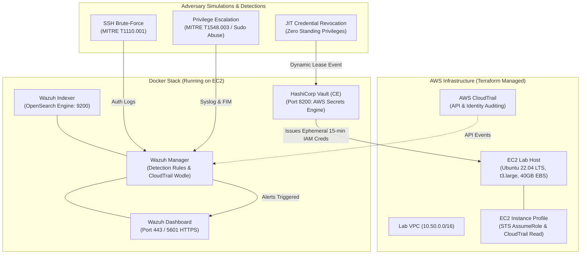

# Identity Threat Detection & Incident Response Lab

[](https://www.terraform.io/)
[](https://www.vaultproject.io/)
[](https://wazuh.com/)
[](docs/MITRE_ATTCK_MAPPINGS.md)

An end-to-end cloud identity security and threat detection engineering lab. Provisions dedicated AWS infrastructure using **Terraform**, runs **HashiCorp Vault (Community Edition)** for dynamic, short-lived Just-In-Time (JIT) AWS IAM credentials, deploys a single-node **Wazuh SIEM stack** ingesting host telemetry and **AWS CloudTrail** logs, executes automated threat simulations (SSH brute-force, Linux privilege escalation), and includes a professional **Incident Response Runbook** mapped to the **MITRE ATT&CK®** framework.

---

## 🏛️ Architecture Overview



---

## ⚡ Key Highlights & Security Value

1. **Zero Standing Privileges with HashiCorp Vault:**  
   Eliminates permanent developer IAM access keys. Vault dynamically provisions temporary IAM users or assumed-role credentials with an enforceable 15-minute lease, automatically revoking credentials upon expiration.
2. **Wazuh SIEM & Detection Engineering:**  
   Custom rules detect unauthorized sudo escalation, suspicious `/etc/shadow` reads, rapid SSH brute-forcing, and anomalous CloudTrail IAM activities.
3. **MITRE ATT&CK Alignment:**  
   Every detection rule, log source, and attack simulation maps directly to MITRE ATT&CK enterprise tactics and techniques.
4. **Actionable Incident Response Runbook:**  
   One-page operational runbook for SOC analysts following NIST SP 800-61 Rev. 2 guidelines (Detection, Containment, Eradication, Post-Mortem).

---

## 🚀 Setup & Deployment Instructions

### Prerequisites
- [AWS CLI v2](https://docs.aws.amazon.com/cli/latest/userguide/install-cliv2.html) installed and configured with appropriate administrator access.
- [Terraform >= 1.5.0](https://www.terraform.io/downloads.html).
- SSH client (or AWS Session Manager plugin).

### Step 1: Clone Repository
```bash
git clone https://github.com/SannidhiSriram-06/identity-threat-detection-lab.git
cd identity-threat-detection-lab
```

### Step 2: Deploy Infrastructure via Terraform
```bash
cd terraform
cp terraform.tfvars.example terraform.tfvars

# Set your SSH key name (optional) and region if different from us-east-1
terraform init
terraform plan
terraform apply -auto-approve
```

Terraform outputs the EC2 Public IP and connection commands:
- `ec2_public_ip`: Public IP of the lab host
- `vault_ui_url`: Web UI URL for Vault (`http://<IP>:8200`)
- `wazuh_dashboard_url`: Web UI URL for Wazuh (`https://<IP>:443`)

### Step 3: Connect to the Lab Host & Start the Docker Stack
Connect via SSH or AWS SSM:
```bash
ssh -i <your-key.pem> ubuntu@<EC2_PUBLIC_IP>
# OR via AWS SSM:
# aws ssm start-session --target <INSTANCE_ID>
```

Navigate to the lab directory and start Vault & Wazuh:
```bash
# Clone the repository onto the instance or sync docker/
cd /opt/identity-lab
git clone https://github.com/SannidhiSriram-06/identity-threat-detection-lab.git .

# Start Docker containers
cd docker
docker compose up -d
```

Verify containers are running:
```bash
docker compose ps
```

### Step 4: Initialize HashiCorp Vault AWS Secrets Engine
Run the automated initialization script to initialize Vault, unseal it, enable the AWS secrets engine, and configure the dynamic 15-minute IAM role:
```bash
docker exec -i vault-identity-lab bash /vault/scripts/init_vault_aws.sh
```

---

## 🎯 Attack Simulations & Detection Demos

All simulations are automated in the `simulations/` directory:

### Simulation 1: SSH Brute-Force Attack
Simulates a rapid dictionary credential spray against port 22:
```bash
cd /opt/identity-lab/simulations
./simulate_ssh_bruteforce.sh 127.0.0.1 22 15
```
**Detection & Outcome:**
- **Wazuh Rule:** `100101` (Severity Level 10: *Possible SSH Brute Force Attack detected*)
- **MITRE ATT&CK:** [T1110.001 (Password Guessing)](docs/MITRE_ATTCK_MAPPINGS.md#1-t1110001--t1110003---brute-force-password-guessing--spraying)
- Verify in host logs: `sudo tail -n 20 /var/log/auth.log`

### Simulation 2: Linux Privilege Escalation & Sudo Abuse
Creates an unprivileged user (`lab_contractor`) attempting unauthorized `sudo` commands and sensitive `/etc/shadow` dumps:
```bash
./simulate_priv_esc.sh
```
**Detection & Outcome:**
- **Wazuh Rules:** `100200` (Sudo auth failure / not in sudoers), `100201` (Multiple privilege escalation attempts), `100202` (Sensitive file access)
- **MITRE ATT&CK:** [T1548.003 (Sudo Abuse)](docs/MITRE_ATTCK_MAPPINGS.md#2-t1548003---abuse-elevation-control-mechanism-sudo-and-sudo-caching)

### Simulation 3: Dynamic JIT Credential Request & Auditing
Requests ephemeral AWS IAM credentials through Vault, tests the credentials against AWS STS, and demonstrates automatic revocation:
```bash
./simulate_vault_jit_access.sh
```
**Detection & Outcome:**
- Validates the principle of **Zero Standing Privileges**.
- CloudTrail records dynamic IAM creation, temporary usage, and lease termination.

### Cleanup Simulation Artifacts
```bash
./cleanup_simulations.sh
```

---

## 📖 Runbooks & Mappings

- 📑 **Incident Response Runbook:** Comprehensive detection, containment, and eradication procedures in [`docs/INCIDENT_RESPONSE_RUNBOOK.md`](docs/INCIDENT_RESPONSE_RUNBOOK.md).
- 🗺️ **MITRE ATT&CK Mapping:** Detailed technique crosswalk in [`docs/MITRE_ATTCK_MAPPINGS.md`](docs/MITRE_ATTCK_MAPPINGS.md).

---

## 💰 Cost & Cleanup

### Software Licensing Cost
- **HashiCorp Vault Community Edition (CE):** Free & Open-Source / BSL.
- **Wazuh SIEM:** 100% Free & Open-Source (GPLv2).
- **Docker CE:** Free & Open-Source.

### AWS Cloud Costs
- The only recurring cost is the **EC2 instance (`t3.large`)** and its EBS volume (~$0.0832/hr in `us-east-1`).
- Running this lab for a 3-hour evaluation will cost approximately **~$0.25 to $0.35 USD**.

### 🧹 Teardown Instructions
To avoid ongoing AWS compute charges, terminate the lab infrastructure as soon as your testing is concluded:

```bash
cd terraform
terraform destroy -auto-approve
```

> [!TIP]
> Always verify with `aws ec2 describe-instances --filters "Name=tag:Lab,Values=Identity-Threat-Detection"` that the instance state is `terminated`.
