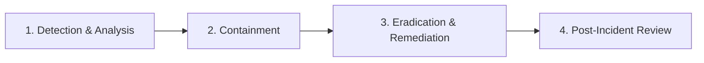

# Incident Response Runbook: Identity & Host Threat Scenarios

> **Classification:** Operational Incident Response Standard Operating Procedure (SOP)  
> **Target Systems:** Linux EC2 Hosts, HashiCorp Vault JIT Engine, AWS CloudTrail / IAM  
> **Relevant Regulations / Frameworks:** NIST SP 800-61 Rev. 2, ISO 27001 A.5.24 - A.5.28  

---

## 🧭 Incident Response Workflow (NIST SP 800-61)



---

## Scenario A: SSH Brute-Force Attack (MITRE T1110.001)

### 1. Detection & Verification
- **Primary Alert:** Wazuh Alert `100101` (Severity Level 10: *Possible SSH Brute Force Attack detected*).
- **Triage Verification:**
  ```bash
  # Check recent failed authentication attempts and attacking IPs
  sudo grep "Failed password" /var/log/auth.log | awk '{print $(NF-3)}' | sort | uniq -c | sort -nr
  # Verify current active SSH connections
  ss -tna '( dport = :22 or sport = :22 )'
  ```

### 2. Immediate Containment
- **Host Firewall Block:**
  ```bash
  ATTACKER_IP="<identified_ip>"
  sudo iptables -I INPUT -s "${ATTACKER_IP}" -p tcp --dport 22 -j DROP
  ```
- **AWS Security Group Isolation:** Remove `0.0.0.0/0` ingress on port 22 immediately from the instance's Security Group via AWS Console or CLI:
  ```bash
  aws ec2 revoke-security-group-ingress --group-id <SG_ID> --protocol tcp --port 22 --cidr 0.0.0.0/0
  ```

### 3. Eradication & Remediation
1. **Disable Password Authentication:** Enforce SSH key-only access or AWS SSM Session Manager:
   ```bash
   sudo sed -i 's/^PasswordAuthentication yes/PasswordAuthentication no/' /etc/ssh/sshd_config
   sudo systemctl restart sshd
   ```
2. **Deploy Fail2Ban Active Response:** Ensure fail2ban jail is enabled for `sshd` with automatic IP banning.

---

## Scenario B: Linux Privilege Escalation & Sudo Abuse (MITRE T1548.003)

### 1. Detection & Verification
- **Primary Alert:** Wazuh Alert `100201` (Severity Level 12: *Multiple Privilege Escalation attempts detected*).
- **Triage Verification:**
  ```bash
  # Inspect sudo failure logs
  sudo journalctl -u sudo --since "1 hour ago" | grep -E "NOT in sudoers|authentication failure"
  # Check active user processes and cron jobs
  ps -u <suspicious_user> -f
  crontab -u <suspicious_user> -l
  ```

### 2. Immediate Containment
- **Lock Compromised User Account:**
  ```bash
  TARGET_USER="<compromised_username>"
  sudo passwd -l "${TARGET_USER}"
  # Terminate all active sessions for the user
  sudo pkill -KILL -u "${TARGET_USER}"
  ```
- **Audit Sudoers Configuration:**
  ```bash
  sudo visudo -c
  ls -la /etc/sudoers.d/
  ```

### 3. Eradication & Remediation
1. Inspect file integrity: Verify that no unauthorized SUID binaries were placed (`find / -perm -4000 -type f`).
2. Verify `/etc/passwd` and `/etc/shadow` checksums with Wazuh Syscheck / FIM database.
3. Review user access authorization under least-privilege principles (RBAC).

---

## Scenario C: AWS IAM Credential Compromise & Unauthorized Cloud Activity (MITRE T1078.004)

### 1. Detection & Verification
- **Primary Alert:** Wazuh Alert `100300` (`CreateAccessKey` without ticket) or `100301` (`ConsoleLogin` without MFA).
- **Triage Verification:**
  ```bash
  # Inspect CloudTrail events for suspicious API calls
  aws cloudtrail lookup-events --lookup-attributes AttributeKey=EventName,AttributeValue=CreateAccessKey --max-items 5
  ```

### 2. Immediate Containment
- **Revoke Compromised AWS Credentials:**
  ```bash
  aws iam update-access-key --user-name <username> --access-key-id <key_id> --status Inactive
  # Or delete the key
  aws iam delete-access-key --user-name <username> --access-key-id <key_id>
  ```
- **If generated through HashiCorp Vault:** Instantly revoke the entire lease tree:
  ```bash
  vault lease revoke -prefix aws/creds/
  ```
- **Attach Explicit Deny Policy:**
  ```bash
  aws iam put-user-policy --user-name <username> --policy-name QuarantineDenyAll --policy-document '{"Version":"2012-10-17","Statement":[{"Effect":"Deny","Action":"*","Resource":"*"}]}'
  ```

### 3. Remediation & Long-Term Prevention
1. **Transition to Just-In-Time (JIT) Credentials:** Eliminate permanent developer IAM user keys in favor of HashiCorp Vault AWS Secrets Engine short-lived STS tokens (15-minute lease).
2. **Enforce Mandatory Multi-Factor Authentication (MFA):** Restrict all IAM console logins with condition `aws:MultiFactorAuthPresent: "true"`.

---

## 📞 Escalation & Contact Checklist
- **Security Operations Lead:** Incident Commander
- **Cloud Infrastructure Team:** Cloud Administrator
- **Compliance Officer:** Mandatory 72-hour breach SLA notification assessment (GDPR Art. 33 / SEC Cyber Rules)
